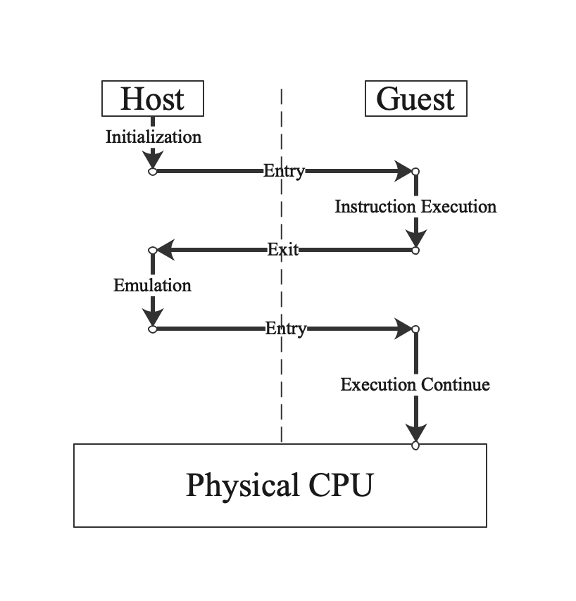

This document contains information about the designing of the Capsule hypervisor.

# Functionality

## Virtual Machines

Supporting Virtual Machines is the basic function for the Capsule hypervisor. A virtual machine contains CPUs, Memory, IO Devices, IO Bus, and other System components just like a real computer.

### CPU

CPU is the central part of a VM. With the hardware assistant virtualization technology (Intel VT-x, for example), instructions inside the VM can run on the physical hardware directly to improve the execution performance. Therefore, the physical CPU needs to have different modes for the Host Machine and Guest Machines. Intel CPUs which support VT-X, use Root Mode for execution of software in Host Machine and Non-Root Mode for execution of software in Guest Machine. ARM CPUs have EL2 for Host and EL0/EL1 for Guest. Although different CPU architectures have different implementations for the hardware assistant virtualization, the basic process is common, which can be depicted as follows: 

  

Most common instructions can be executed in the Guest Mode directly, while some priviledge instructions need to be emulated in the Host Mode with the Capsule hypervisor. Codes for emulations are CPU implementation relative and need to be analyzed case by case accoring to the hardware specifications.

#### X86

#### ARM

# Performance

# Security

# Reliablility
