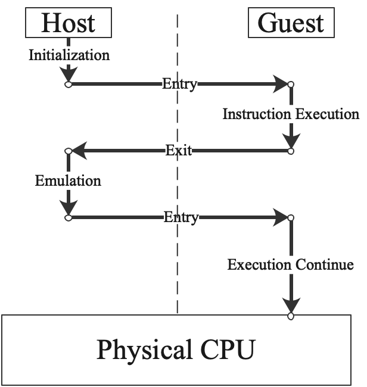

本文档包含了Capsule Hypervisor的设计思路。

# 功能性

Capsule Hypervisor基于软硬结合的思路，采用一套架构支持通用虚拟机(Common Virtual Machine)、安全容器(Micro-VM)、逻辑分区(Logical Partition)三种运行形态。

## 虚拟机

对虚拟机的支持是Capsule Hypervisor的基本功能。为了让虚拟机能够以无差别方式运行为真实机器开发的软件，虚拟机就必须像真实的机器一样包含CPU、内存、IO设备、IO总线和其它系统组件。

### 虚拟CPU

虚拟CPU是一台虚拟机的核心部件，而执行指令是它的核心功能。借助硬件辅助虚拟化技术(如Intel的VT-x技术)，虚拟机内部的指令可以直接在物理CPU上执行，从而提升执行性能。因此，物理CPU需要为宿主机软件和虚拟机软件准备不同的执行环境或模式。对于支持VT-x特性的Intel CPU，根模式(Root Operation)用来执行宿主机软件，而非根模式(Non-Root Operation)用来执行虚拟机软件。类似地，ARM架构的CPU使用EL0/EL2模式来执行宿主机软件，使用EL0/EL1模式来执行虚拟机软件。 尽管不同CPU体系统架构具有不同的硬件辅助虚拟化实现方式，但是基本流程是相似的，如下图所示：

  

对于每个虚拟CPU来说，它是宿主机上的一个普通线程，具备宿主机状态。经过一系统的初始化动作后，宿主机上的虚拟CPU线程会进入到(entry)虚拟机模式，开始按虚拟机状态发生变化。此时，大部分的虚拟机指令可以在此模式直接运行，只有当某些特殊情况发生时(如X86架构下端口操作指令访问的端口并不真实存在)，物理CPU会退出(exit)回到宿主机模式，退出前虚拟机的状态会被保存，而退出后宿主机状态被恢复，物理CPU重新进入虚拟CPU线程开始仿真(emulate)虚拟机的指令(与CPU体系架构相关，需要一个个单点分析)。仿真动作完成后，物理CPU又继续回到虚拟机模式并恢复虚拟机的状态开始执行，直到下一次退出的发生。

除了指令执行，虚拟CPU同样需要处理中断和异常。异常通常被认为是伴随指令执行同步发生的，往往是由于指令并不具备正常完成条件时产生；；而中断是由于外部事件异部产生的，如IO设备完成IO请求时发出的中断事件。中断和异常发生时需要CPU能够暂时停止当前任务的执行，转而执行中断或异常处理任务；等到中断或异常处理任务结束后，CPU再恢复被打断的任务继续执行。硬件辅助虚拟化技术下，虚拟机异常也往往在虚拟机模式被处理，除非不适合在虚拟机中处理的才会退出到宿主机模式处理。虚拟机中断分为发生、路由、注入、处理几个部分：发生动作通常由虚拟设备模拟程序触发，路由动作是模拟目标CPU寻找过程，而注入动作往往发生在目标CPU的entry阶段，处理则是CPU进入虚拟机模式后立刻开始执行中断处理任务。另外，当物理CPU处理虚拟机模式时，对于接收到的物理中断，会促使物理CPU退出到宿主机模式进行中断的处理，除非该物理中断本来就是发给虚拟机处理的，此时不会退出，如直通设备产生的中断。

每个虚拟CPU还需要模拟一个本地时钟，作为时钟源和时钟事件源：时钟源用于获取时间，类似现实生活中的手表；时钟事件源用于经过特定时间段后产生中断，类似现实生活中的闹钟。这部分功能往往也通过硬件辅助方式实现。

在基本功能和特性的模拟之外，虚拟CPU线程受宿主机操作系统内核的任务调度子系统管理，只有当虚拟CPU线程被调度成为物理CPU的当前执行任务时，虚拟CPU才真正获得执行，也才真正取得物理资源。目前Capsule Hypervisor仍是复用Linux内核的调度系统，但是未来有可能会使用定制内核。因此，Capsule期望能设计一套与具体内核实现解耦的API适配层。

### 虚拟内存

为实现对多任务的支持，每个虚拟CPU需要模拟一个虚拟MMU(Memory Management Unit)，使得虚拟CPU上的任务可以通过虚拟地址(GVA， Guest Virtual Address)访问内存。在硬件辅助虚拟化技术下，MMU要完成两级地址转换，GVA->GPA->HPA，其中GPA是Guest Physical Address，HPA是Host Physical Address。其中第一级转换过程中的缺页异常在虚拟机模式下完成，而第二级转换过程的缺页异常则退出到宿主机模式下完成，过程中需要使用Linux内核的内存按需分配能力。

### 虚拟IO设备与IO总线

与KVM的设计类似，Capsule Hypervisor是处于内核态和物理硬件打交道的一个模块，对于虚拟IO设备和总线的模拟完全由用户态的辅助程序完成，这里我们使用[StratoVirt项目](https://gitee.com/openeuler/stratovirt)。

虚拟IO设备包含存储、网络、图形和各类异构加速设备；IO总线主要支持常用的PCI总线，实现虚拟机的MMIO，DMA和中断路由操作。

### 其它虚拟组件

包含虚拟机运行过程中必需的固件和传统外设。

## 逻辑分区

逻辑分区可以看成是虚拟机的一个特例，CPU、内存和外设均以独占的方式使用，无法复用和调度，实现思路如下图所示：

  

其中，管理分区是Capsule Hypervisor所运行的系统，一旦某个物理CPU被分配给一个逻辑分区后，该物理CPU就会从管理分区中下线，完全脱离管理分区的管辖(无法对分区中的CPU进行任务调度)，并重新进入初始化过程，进而开始执行逻辑分区中的程序；物理内存会被划分成独立的区间供不同逻辑分区命名用，通过硬件辅助虚拟化技术中的内存隔离能力可以确保不同逻辑分区不会相互干扰，但是GPA到HAP转换阶段不会产生缺页异常；此外，外部设备借助虚拟设备直通技术以独占方式被逻辑分区使用。

## 用户态与内核态接口

内核模块呈现全局唯一/dev/capsule字符设备，用户态模块通过ioctl使用全局基本功能：
>* API兼容性获取；
>* 创建虚拟机或分区；

每个虚拟机或分区对一个虚机字符设备，用户态模块通过ioctl使用虚拟机相关基本功能：
>* 设置虚拟机用户态地址区间；
>* 创建中断控制器并设置默认中断路由；
>* 为虚拟机设备申请eventfd和irqfd；
>* 创建虚拟CPU
>* 为虚拟CPU映射与内核共享数据区间

每个虚拟CPU对应一个字符设备，用户态模块通过ioctl使用虚拟CPU相关基本功能：
>* 开始执行，进入虚拟机模式；

# 性能

# 安全性

# 可靠性
